= Apache Karaf's Journey

== Links

- https://karaf.apache.org/[Karaf Home]

- https://github.com/apache/karaf/blob/main/examples/karaf-camel-example/README.md[Github Karaf Samples]

- https://camel.apache.org/camel-karaf/3.21.x/index.html[Apache Camel Karaf]

- https://camel.apache.org/camel-karaf/3.21.x/components.html[Apache Karaf Features]

- https://cwiki.apache.org/confluence/display/CAMEL/Karaf[Karaf Camel Commands]

- https://camel.apache.org/components/3.21.x/websocket-component.html[Jetty Websocket]

- https://github.com/apache/camel-karaf-examples[Camel Karaf Git Samples]

- https://camel.apache.org/camel-karaf/3.21.x/components.html[Apache Camel Karaf Features]

- https://github.com/apache/karaf/blob/main/examples/karaf-camel-example/README.md[README Camel Karaf Commands]

- https://karaf.apache.org/manual/latest/[Karaf Official Documentation]

- https://github.com/jgoodyear/ApacheKarafCookbook[Karaf Cookbook Github]

- https://stackoverflow.com/questions/57480441/how-to-fix-org-osgi-framework-bundleexception-unable-to-cache-bundle[Cache Bundle Exception]

- https://icodebythesea.blogspot.com/2011/11/creating-your-own-apache-karaf-console.html[Own Karaf Command Mission]

- https://github.com/seijoed/osgi-starter[OSGI Starter GitHub]

- https://lucian-davitoiu.medium.com/a-camel-project-example-with-java-beans-and-osgi-blueprint-in-karaf-5dc172e09829[Beans OSGI Camel on Karaf]

[source,html]
----
https://www.mail-archive.com/search?l=users@camel.apache.org&q=subject:%22Re%5C%3A+route%5C-list+in+apache%5C-karaf+does+not+work%22&o=newest&f=1
----

.Java & Maven versions
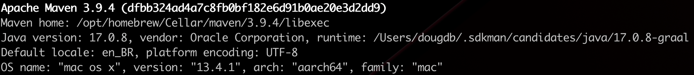

.Maven Commands to run the App
[source,bash]
----
mvn clean compile verify
mvn camel-karaf:run -DskipTests=true
# Or
mvn -DskipTests compile verify camel-karaf:run
----

== Karaf Commands

.Karaf 4.4.4 Commands
[source,bash]
----
install <id>
uninstall <id>
start
stop
resolve
resfresh
update # subtle differece
list
info
headers <id>
imports
exports
start-level
bundle-level
framework
show-tree
create-dump
dynamic-import
watch
print-stack-traces
restart
grep/cat/tail/pipes
shutdown -f

feature:repo-add camel 3.21.2

feature:repo-add mvn:org.apache.camel.karaf/apache-camel/3.21.2/xml/features

feature:repo-add mvn:com.inhouse.atm.bff.karafosgi.orchestrator/atm-bff-karafosgi-orchestrator/0.1.0/xml/features

feature:list | grep –i camel

feature:install http
feature:install scr
feature:install camel
feature:install camel-spring
feature:install camel-core
feature:install camel-jetty
feature:install camel-jackson
feature:install camel-blueprint
feature:install camel-karaf-command
feature:install camel-websocket
feature:install aries-blueprint

feature:install aries-blueprint-spring
feature:install shell
feature:install shell-compat
feature:install cdi
feature:install jndi
feature:install subsystems

feature:install atm-bff-karafosgi-orchestrator
# just process the feature file
# needs be installed after addurlfile command
features:addurlfile:///[PathToFile]/feature.xml
features:removeurlfile:///[PathToFile]/feature.xml
features:addUrl mvn:org.myorg/myFeature/1.0.0/xml/features

feature:uninstall atm-bff-karafosgi-orchestrator

feature:repo-remove mvn:com.inhouse.atm.bff.karafosgi.orchestrator/atm-bff-karafosgi-orchestrator/0.1.0/xml/features

feature:list | grep atm
feature:list | grep camel
feature:list | grep camel-spring

# Karaf Cookbook
install -s mvn:com.karaf.journey/command/1.0.0
bundle:install -s mvn:com.karaf.journey/command

log:tail
log:display
log:display-exception
----

.Camel Blueprint Bean/XML Router Style
[source,xml]
----
<?xml version="1.0" encoding="UTF-8"?>
<blueprint xmlns="http://www.osgi.org/xmlns/blueprint/v1.0.0"
           xmlns:xsi="http://www.w3.org/2001/XMLSchema-instance"
           xmlns:cm="http://aries.apache.org/blueprint/xmlns/blueprint-cm/v1.1.0"
           xsi:schemaLocation="
         http://www.osgi.org/xmlns/blueprint/v1.0.0 https://www.osgi.org/xmlns/blueprint/v1.0.0/blueprint.xsd
         http://camel.apache.org/schema/blueprint http://camel.apache.org/schema/blueprint/camel-blueprint.xsd
         http://aries.apache.org/blueprint/xmlns/blueprint-cm/v1.1.0 http://aries.apache.org/schemas/blueprint-cm/blueprint-cm-1.1.0.xsd">

  <!--
  <cm:property-placeholder persistent-id="HelloBean" update-strategy="reload">
    <cm:default-properties>
      <cm:property name="greeting" value="Hi from Camel" />
    </cm:default-properties>
  </cm:property-placeholder>

  <bean id="helloBean" class="com.karaf.journey.HelloBean">
      <property name="say" value="${greeting}"/>
  </bean>
  -->

  <bean class="com.karaf.journey.GreetingResourceRoute" id="greetingResourceRouter"/>

  <camelContext id="blueprint-bean-context" xmlns="http://camel.apache.org/schema/blueprint">
    <routeBuilder ref="greetingResourceRouter"/>
    <!--
    <route id="timerToLog">
      <from uri="timer:foo?period=5000"/>
      <setBody>
          <method ref="helloBean" method="hello"/>
      </setBody>
      <log message="The message contains ${body}"/>
      <to uri="mock:result"/>
    </route>
    -->

  </camelContext>

</blueprint>
----

== Solution Overview

.Karaf Camel Arch Macro Solutions
image::thumb/images/atm_karaf_camel_solution-overview.png[]

.ReactJS
[source,bash]
----
npm install --save react-websocket
npm install --save react-use-websocket@3.0.0
----

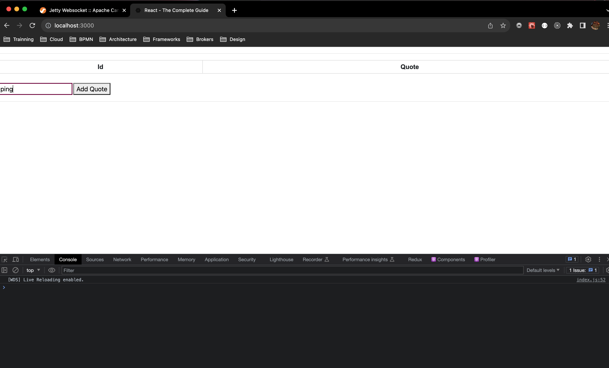

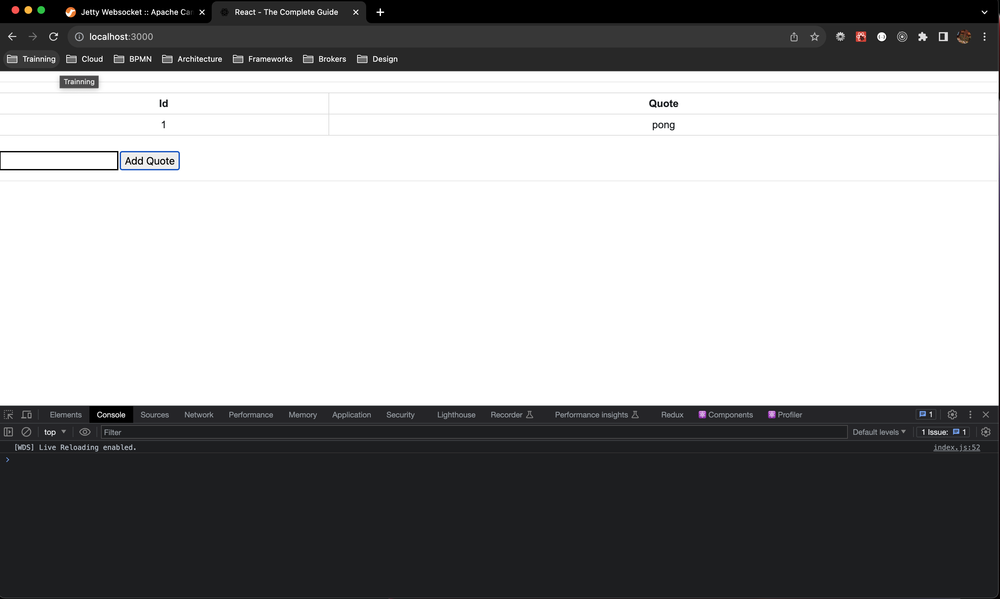

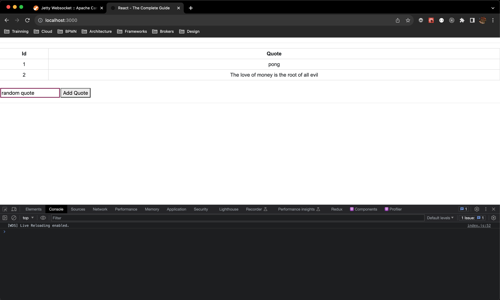

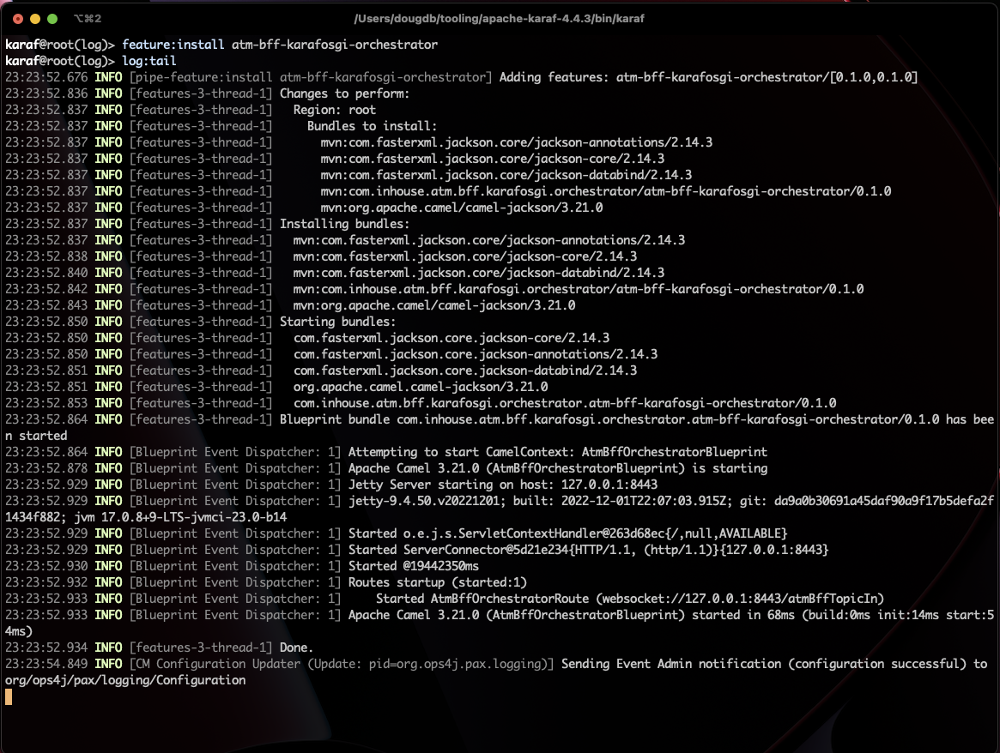

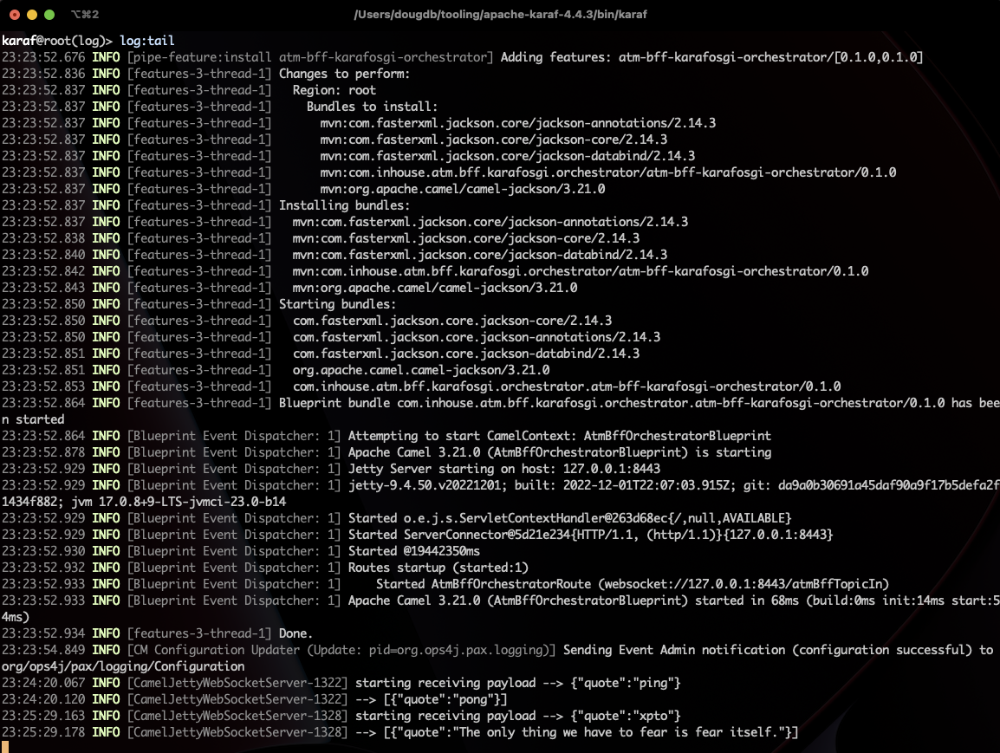

.Karaf-command Archetype
[source,bash]
----
mvn archetype:generate \
-DarchetypeGroupId=org.apache.karaf.archetypes \
-DarchetypeArtifactId=karaf-command-archetype \
-DarchetypeVersion=4.4.4 \
-DgroupId=com.your.organization \
-DartifactId=com.your.organization.command \
-Dversion=1.0.0 \
-Dpackage=com.your.organization
----

[source,xml]
----
<plugin>
	<groupId>org.codehaus.mojo</groupId>
	<artifactId>build-helper-maven-plugin</artifactId>
	<executions>
		<execution>
			<id>attach-artifacts</id>
			<phase>package</phase>
			<goals>
				<goal>attach-artifact</goal>
			</goals>
			<configuration>
				<artifacts>
					<artifact>
						<file>target/classes/features.xml</file>
						<type>xml</type>
						<classifier>features</classifier>
					</artifact>
				</artifacts>
			</configuration>
		</execution>
	</executions>
</plugin>
----

=== Deployment Options

* Deployment bundles
. Bundle is jar file with an OSGi-compatible manifest file
* Deployment feature descriptors
* Deployment non-OSGi jars
* Deployment WAR
* Deployment Spring/Blueprint
* Deployment Karaf Archive

To deploy the bundle, you need to know the _groupid_ and _artifactId_ for the bundle, which can be found in the pom.xml file:

.Deploy bundle in Karaf
[source,xml]
----
<groupId>com.your.organization</groupId>
<artifactId>custom-command</artifactId>
----

.Install Bundle using Karaf CLI
[source,bash]
----
install mvn:com.your.organization/custom-command/1.0.0-SNAPSHOT

install mvn:com.hello.karaf/hello-karaf/1.0.0
----

.OSGi headers
[%header,cols=2*]
|===
|Header
|Purpose
|Bundle-ActivationPolicy
|This tells runtime if the bundle should be loaded lazily,
meaning start is not called until the first access of the
class occurs.
|Bundle-Activator
|It specifies the class implementing the org.osgi.
framework.BundleActivator interface.
|Bundle-Category
|A comma-separated list of category names.
|Bundle-Classpath
|This is a manual control of where to load classes from
within the bundle. The default is "." or the root of the
bundle; however, one may specify embedded jars into
the classpath.
|Bundle-ContactAddress
|This specifies where to find more information on the
bundle. Typically a website URL, organization, or
project maintainer.
|Bundle-Copyright
|Indicates copyright holder of the bundle.
|Bundle-Description
|A brief text description of the bundle's purpose.
|Bundle-DocURL |URL to find more information in a bundle.
|Bundle-Icon
|A list of icon URLs that can be used to represent the
bundle. Icon files may be internal to the bundle or an
absolute web address. No specific format is required.
|===

[source,bash]
----
# Feature Console
repo-add mvn:com.karaf.journey/feature-bndf/1.0.0/xml/features
install packaging-all-modules
uninstall packaging-all-modules
repo-remove mvn:com.karaf.journey/feature-bndf/1.0.0/xml/features
list | grep –i "packaging-all-modules"
----

.Feature with Multiple Bundles install
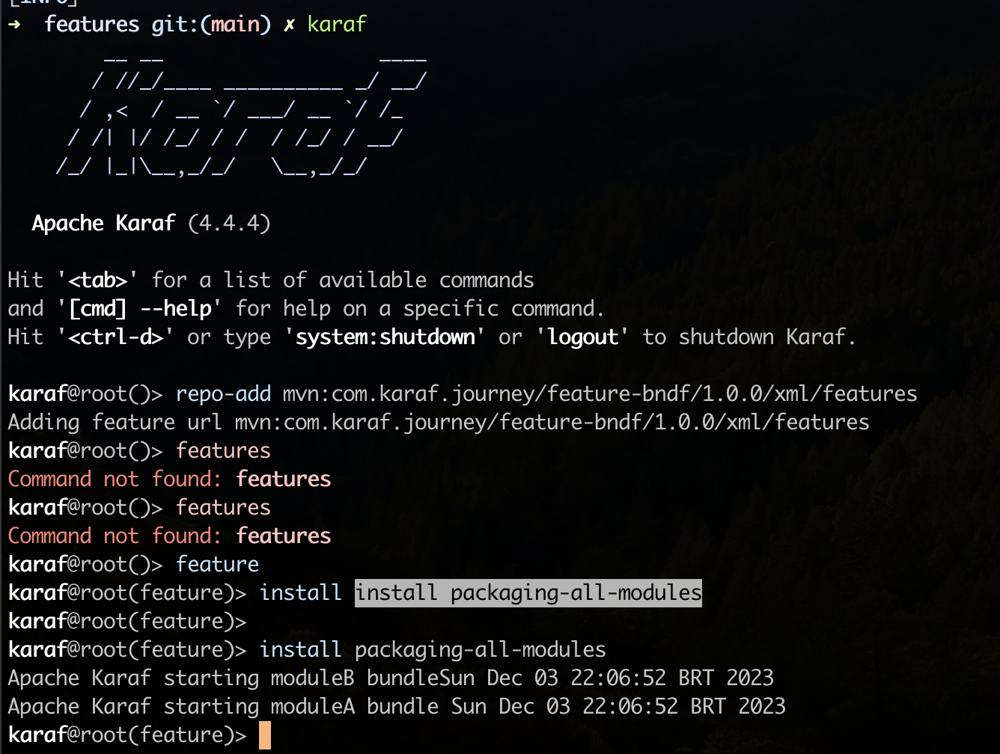

.OSGi Bundles Lifecycle
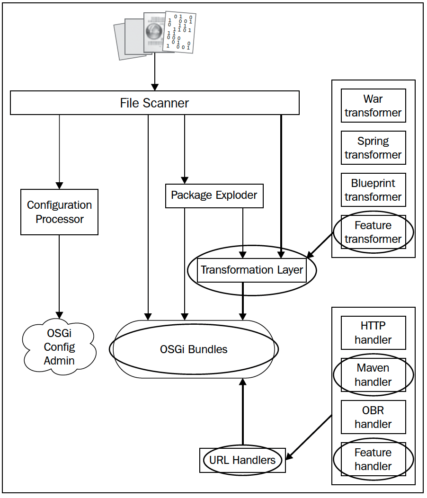

== Smart Routers with Apache Camel

* One of the more common projects to be hosted on Karaf is the Apache Camel-based router

* When the camel-karaf-commands bundle is installed into Karaf via the Camel feature, the Camel commands become automatically available on the Karaf console.

* When the context-list command is executed, the context IDs of each Camel Context deployed is displayed along with their current status, and if available, their uptime

.Karaf Repo Apache Camel Add
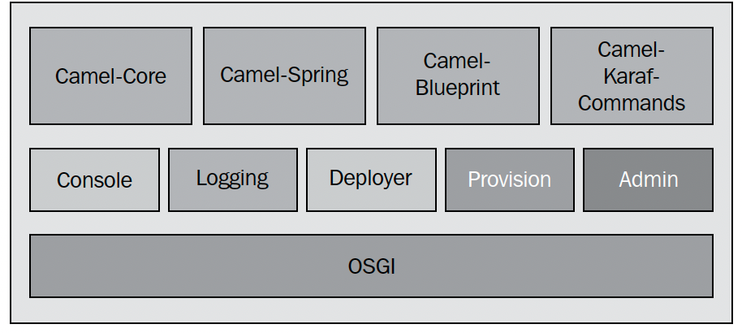

.Karaf Camel Context List
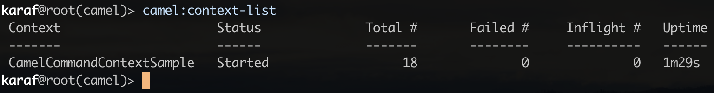

.Install Sample Application
[source,bash]
----
# OSGI Camel on DSL and SCR doesn't works
feature:repo-add mvn:com.karaf.journey/router-dsl-features/LATEST/xml
install router-dsl

install -s mvn:com.karaf.journey/sample/1.0.0

#
karaf@root(camel)> context-list
karaf@root(camel)> context-resume
karaf@root(camel)> context-start CamelCommandContextSample
karaf@root(camel)> context-stop CamelCommandContextSample
karaf@root(camel)> context-suspend CamelCommandContextSample
karaf@root(camel)> route-list CamelCommandContextSample
----

.Camel Route List info
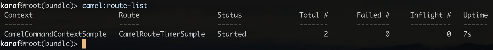

.Pragmatic Archetype Setup
[source,markdown]
----
Camel Router Project for Blueprint (OSGi)
=========================================

To build this project use

    mvn install

To run the project you can execute the following Maven goal

    mvn camel-karaf:run

To deploy the project in OSGi. For example using Apache ServiceMix
or Apache Karaf. You can run the following command from its shell:

    osgi:install -s mvn:com.karaf.journey/jetty-blueprint-sample/1.0.0

For more help see the Apache Camel documentation

    http://camel.apache.org/

----

.curl Command to jetty-sample
[source, bash]
----
karaf@root(feature)> repo-add mvn:com.karaf.journey/jetty-blueprint-sample/1.0.0/xml/features

karaf@root(feature)> uninstall jetty-blueprint-sample

curl -v http://localhost:9090/sample
#email
curl -v -X POST -H "Content-Type: application/json" http://localhost:9090/sample -d '{ "notification": { "type": "email", "to": "foo@bar.com", "message": "This is a test", "service": "smtp://mail.server" }}'

#http
curl -v -X POST -H "Content-Type: application/json" http://localhost:9090/sample -d '{ "notification": { "type": "http", "to": "foo@bar.com", "message": "This is a test", "service": "https://web.server" }}'

#Unknown
curl -v -X POST -H "Content-Type: application/json" http://localhost:9090/sample -d '{ "notification": { "type": "unknown", "to": "foo@bar.com", "message": "This is a test", "service": "https://web.server" }}'
----

.Blueprint samples commands
[source, bash]
----
# root main pom (blueprint-samples)
mvn clean compile install
# karaf
kf clean
#
karaf@root(feature)> repo-add mvn:com.karaf.journey.blueprint.sample.feature/sample-feature/1.0.0/xml/features
#
karaf@root(feature)> install sample-provider
#
karaf@root(feature)> install sample-client
----

.Blueprint Sample result
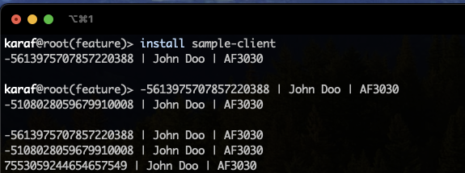